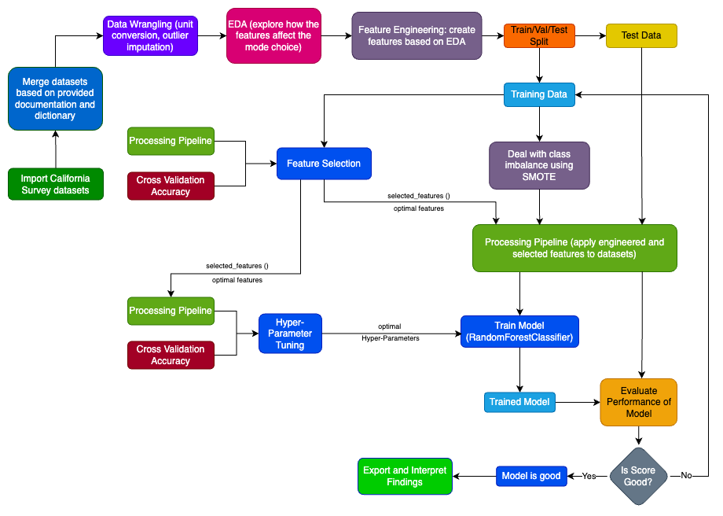

# CME-538-Mickey-Mousers
Repository for Mickey Mousers for the CME538 group project.

The focus is on full-time students & full-time workers

Main Source:
2010–2012 California Household Travel Survey
https://www.nrel.gov/transportation/secure-transportation-data/tsdc-california-travel-survey.html

The raw survey data is 400MB in .accdb file format (1,406,413 rows and 362 columns in total); therefore, it is compressed and uploaded here:
https://utoronto-my.sharepoint.com/:u:/r/personal/n_zhu_mail_utoronto_ca/Documents/Attachments/chts2013-caltrans-raw-survey.zip?csf=1&web=1&e=DtMssE

Weather API Source:
https://open-meteo.com/en/docs/historical-weather-api

