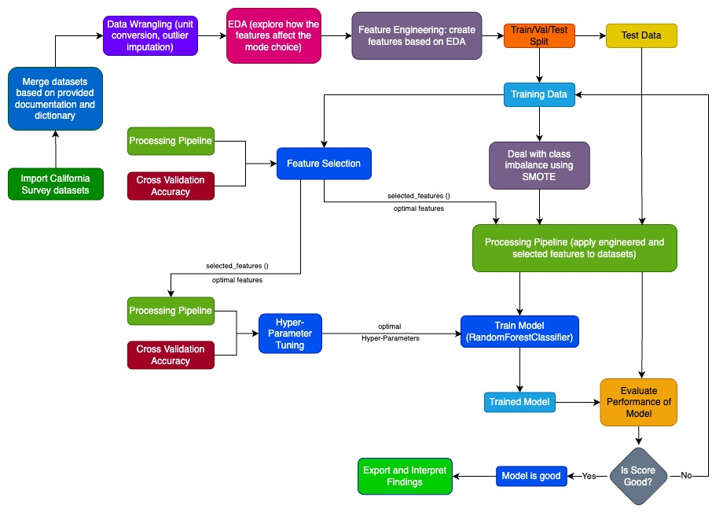

# CME-538-Mickey-Mousers
Repository for Mickey Mousers for the CME538 group project.

## Project Overview

This project explores travel mode choice behavior among California’s students and workers using data from the **2010–2012 California Household Travel Survey (CHTS)**. The survey contains detailed travel, demographic, and household data, offering over 1.4 million records for analysis. By combining machine learning models and data-driven insights, the project aims to develop actionable solutions for sustainable transportation planning.

### **Scope**
- Focus on two key population groups: **students** and **workers**.
- Predict mode choice (e.g., car, transit, active transportation) using socio-demographic, geographic, and temporal features.
- Develop separate models for students and workers to highlight differences in travel behavior.

### **Significance**
- **Supports sustainable transportation**: Encourages data-driven policy decisions to reduce congestion and emissions.
- **Informs planning**: Helps planners tailor strategies for distinct commuter groups.
- **Scalable insights**: Offers a blueprint for transportation modeling approach applicable to other regions & datasets.

## Data Sources
Main Source:
2010–2012 California Household Travel Survey
https://www.nrel.gov/transportation/secure-transportation-data/tsdc-california-travel-survey.html

The raw survey data is 400MB in .accdb file format (1,406,413 rows and 362 columns in total); therefore, it is compressed and uploaded here:
https://utoronto-my.sharepoint.com/:u:/r/personal/n_zhu_mail_utoronto_ca/Documents/Attachments/chts2013-caltrans-raw-survey.zip?csf=1&web=1&e=DtMssE

Weather API Source:
https://open-meteo.com/en/docs/historical-weather-api

## Attribution Table

| **Task**                         | **Tyler Y. Hu**                    | **Nick Zhu**                              | **Raymond Li**                           | **Kenny Qiu Fen**                        |
|-----------------------------------|-------------------------------------|-------------------------------------------|------------------------------------------|------------------------------------------|
| **Project Coordination**          | Coordinated tasks and deadlines     | Assisted with team communications         | Assisted in aligning model tasks         | Supported task organization              |
| **Dataset Preparation**           | Integrated datasets and managed APIs; contributed to weather API integration | Led data cleaning and merging             | Supported with weather API integration and feature preparation       | Assisted with geospatial data integration|
| **Data Wrangling**                | Oversaw dataset processing          | Cleaned and filtered data                 | Provided guidance on feature engineering and handled weather API data | Assisted with reviewing processed data   |
| **Exploratory Data Analysis (EDA)**| Contributed to EDA insights         | Conducted key visualizations and analysis | Analyzed trends for modeling             | Focused on visual presentation of EDA    |
| **Feature Engineering**           | Supported variable selection        | Led feature creation                      | Prioritized features based on model needs| Assisted with categorical feature encoding|
| **Model Development**             | Developed and refined Random Forest; focused on result visualization | Built initial models for students         | Designed and tuned worker models         | Supported in analyzing results for workers |
| **Model Evaluation**              | Evaluated Random Forest performance | Reviewed validation datasets              | Designed evaluation metrics              | Contributed to interpretation of results |
| **Visualization**                 | Contributed to presentation visuals | Provided visual inputs for data trends    | Assisted in result plotting              | Created impactful graphics for findings  |
| **Documentation and Reporting**   | Led report organization and quality | Assisted in drafting key sections         | Focused on technical content and insights| Drafted presentation and Medium article  |
| **GitHub Management**             | Managed overall organization and repository | Provided support for data upload          | Assisted with code contributions         | Maintained repository and references     |

**Summary of Coding Contributions**:
- **Tyler**: Data processing, EDA, result visualization, and GitHub organization.
- **Nick**: Initial data merging, EDA, and model building for students.
- **Raymond**: Data wrangling, weather API integration, and model building for workers.
- **Kenny**: Weather API integration, data processing, and model building for workers.

For detailed contributions, please see the commit/version history in the GitHub repository.
